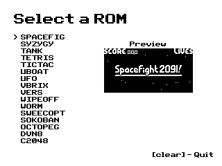
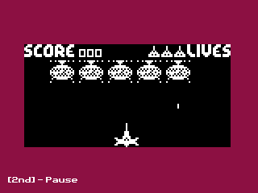

# Chip-84
The first CHIP-8 emulator/interpreter written in C using the CE C Programming Toolchain (https://github.com/CE-Programming/toolchain) for the TI-84 Plus CE calculator.  It supports SuperChip-8 ROMs (programs that use the extended 128x64 display and extra instructions), custom keymapping, and emulation speed control.

 

## Included in the Release:
- The emulator program
- A converter to convert ROM files to AppVars which you can then transfer to your calculator

You will need to have the CE C Libraries (https://github.com/CE-Programming/libraries) to run this.

## Converting ROMs
To convert your CHIP-8 or SCHIP-8 ROMs, use the included ROM converter program for Windows, or use [the online ROM converter](https://christiankosman.com/rom-converter).
